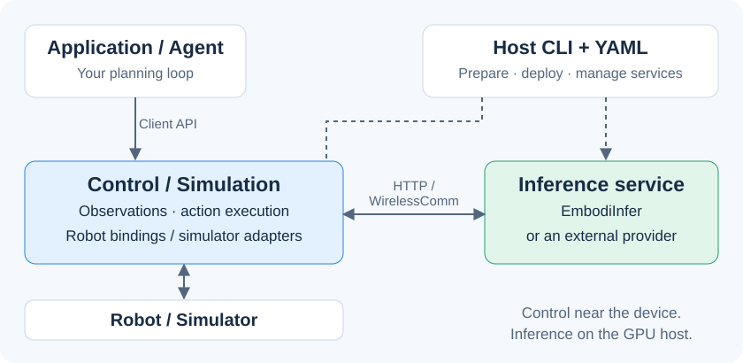

<p align="center">
  
</p>

<h3 align="center">From model predictions to robot actions.</h3>
<p align="center">
  <a href="https://embodirun.readthedocs.io/">Documentation</a> ·
  <a href="#quick-start">Quick start</a> ·
  <a href="#demos">Demos</a> ·
  <a href="#performance">Performance</a> ·
  <a href="docs/support-matrix.md">Support matrix</a> ·
  <a href="README.zh-CN.md">简体中文</a>
</p>

[](LICENSE)
[](pyproject.toml)
[](https://embodirun.readthedocs.io/)

**EmbodiRun is a deployment and execution runtime for embodied AI.** Describe
your devices, inference services, and compute nodes in YAML, then run the
observation–inference–action loop through a shared runtime. Keep control beside
the robot and place inference on a GPU host, or run both on one machine.

Use [EmbodiInfer](https://github.com/BUAA-CI-LAB/EmbodiInfer) as the inference
engine, connect an external model service, or bring an agent with its own
planning loop.

## Demos

| Three robots, one inference service | Comparing inference engines on SO-101 |
|---|---|
| [](https://embodirun.readthedocs.io/en/latest/demos/multi-robot-serving/) | [](https://embodirun.readthedocs.io/en/latest/demos/engine-e2e-contrast/) |
| Three SO-101 arms using a shared π0.5 inference service, with one rollout process per device. | π0.5 on a Jetson AGX Thor with an SO-101 arm: EmbodiInfer over HTTP and WirelessComm, SGLang, and native LeRobot. |

Click a preview to watch the video and explore its setup and measurements.

## Why EmbodiRun?

- **Deploy from one configuration.** Describe the nodes, environments, devices,
  and model bindings once. The Host CLI prepares environments and manages
  service startup, inspection, and shutdown.
- **Share inference across devices.** Each device runs its own control loop and
  connects to a model endpoint over HTTP or WirelessComm.
- **Give agents a robot interface.** Observe, propose, execute, inspect, and
  cancel through a dependency-free Python client. Your agent keeps its planner;
  the runtime handles device ownership and execution.
- **Reuse the execution machinery.** Observation capture, recording, action
  validation, and manual takeover live in the runtime. Robot-specific adapters
  and policy bindings handle the hardware details.

## How it works



**Host** prepares and launches the deployment. **Control** owns robot connections,
observations, and action execution; **Simulation** serves simulator environments.
**Inference** turns observations into predictions. These services can run on
separate machines. See [Architecture](docs/architecture.md) for the full design.

## Performance

### π0.5 on a real SO-101 arm

On a Jetson AGX Thor, the recorded comparison reduced median inference latency
from **1,061 ms to 162 ms** and the complete control-loop chunk from
**3,592 ms to 2,660 ms**. Faster inference shortens the loop; action playback
still accounts for about 2.45 seconds per chunk.

| Engine | Transport | Inference latency | Full chunk time |
|---|---|---:|---:|
| **EmbodiInfer** | WirelessComm | **162 ms** | **2,660 ms** |
| EmbodiInfer | HTTP | 170 ms | 2,666 ms |
| SGLang | HTTP | 194 ms | 2,713 ms |
| Native LeRobot | HTTP | 1,061 ms | 3,592 ms |

Medians over 15 chunks per run, with the same SO-101 checkpoint, 10 denoising
steps, two cameras, and 50-step action chunks at 20 Hz. EmbodiInfer uses its
optimized path, SGLang uses upstream defaults, and LeRobot uses eager execution.
The [demo report](docs/demos/engine-e2e-contrast.md) describes the hardware,
engine settings, and timing breakdown.

For transport measurements, see the [HTTP/WirelessComm experiment](docs/inference-transport.md).
For model-only benchmarks, see [EmbodiInfer](https://github.com/BUAA-CI-LAB/EmbodiInfer#performance).

## Quick start

### Try the runtime on your laptop

Install from source with Python 3.10+ and [uv](https://docs.astral.sh/uv/) 0.12.x:

```bash
git clone https://github.com/BUAA-CI-LAB/EmbodiRun.git
cd EmbodiRun
uv sync --frozen
```

Try the local simulated-device walkthrough:

```bash
uv run python examples/run_shared_device_fake.py
```

It starts a local Control service with simulated joints and a fake camera,
exercises observation, execution, recording, and cancellation, and shuts the
service down. No robot, model checkpoint, or GPU is required.

### Connect your robot or simulator

Continue with [Quick start](docs/quickstart.md) to use the deployment CLI.
For hardware, choose a combination from the [support matrix](docs/support-matrix.md),
configure its devices and calibration, and read [Safety](docs/safety.md)
before execution.

## Supported integrations

### Robots and simulators

| Target | Policy | Inference backend | Available integration |
|---|---|---|---|
| SO-101 | π0.5 | EmbodiInfer | [Deployment config](configs/http-wireless-inference/http.yaml), software tests, [real-robot demos](#demos) |
| Bi-SO-101 | π0.5 | EmbodiInfer | [Dual-arm deployment](docs/pi05-bi-so101.md), software tests |
| Franka FR3 | π0.5 | Policy-service API | Adapter and binding, software tests |
| ARX5 | DM0.5 | EmbodiInfer | Experimental adapter and binding |
| Unitree Go2 | StreamVLN | EmbodiInfer | Experimental robot agent and binding |
| LIBERO | π0.5 | EmbodiInfer / SGLang | [Deployment configs](configs/simulation/), software tests |
| VLABench | π0.5 | EmbodiInfer | Experimental [deployment config](configs/simulation/vlabench-pi05-vvla.yaml) |
| Habitat | StreamVLN | EmbodiInfer | Experimental [deployment config](configs/simulation/habitat-streamvln-vvla.yaml) |
| Isaac Sim | StreamVLN | EmbodiInfer | Experimental [deployment config](configs/simulation/isaac-streamvln-vvla.yaml) |

The [full support matrix](docs/support-matrix.md) lists hardware requirements,
optional dependencies, and test coverage for each combination. SO-101 shared
inference uses independent single-arm clients; Bi-SO-101 uses a coordinated
dual-arm policy.

### Agents and external services

| Integration | Connect through | Guide |
|---|---|---|
| Your own agent or planner | Python client: observe, propose, execute, inspect, cancel | [Agent workflow](docs/agent-workflow.md) |
| RPent | Experimental agent adapter | [RPent integration](docs/rpent-integration.md) |
| External inference service | Versioned policy API and provider configuration | [Inference contract](docs/http_api.md), [configuration](docs/configuration.md) |
| XLeRobot | Experimental, separately installed hardware-owner package | [Owner integration](integrations/xlerobot_owner/README.md) |

## Documentation

| Task | Guide |
|---|---|
| Install and run | [Installation](docs/installation.md) · [Quick start](docs/quickstart.md) |
| Configure a deployment | [Configuration](docs/configuration.md) |
| Operate devices | [Control](docs/control.md) · [Safety](docs/safety.md) |
| Extend the runtime | [Architecture](docs/architecture.md) · [Python API](docs/api.md) |
| Review evidence | [Support matrix](docs/support-matrix.md) · [Experiments](docs/experiments.md) |

## Contributing

See [CONTRIBUTING.md](CONTRIBUTING.md) for development setup and checks.
Use [GitHub issues](https://github.com/BUAA-CI-LAB/EmbodiRun/issues) for bugs and
feature requests, and follow [SECURITY.md](SECURITY.md) for private vulnerability
reports. Community participation follows our [Code of Conduct](CODE_OF_CONDUCT.md).

## License

Apache-2.0. See [LICENSE](LICENSE), [NOTICE](NOTICE), and
[third-party notices](THIRD_PARTY_NOTICES.md). Model weights, datasets, robot
SDKs, and simulators retain their own licenses.
