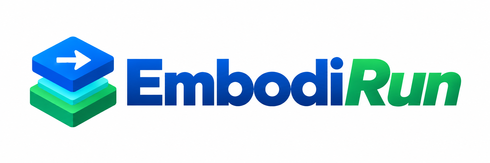

<p align="center">
  
</p>

**English** | [简体中文](README.zh-CN.md)

**Deploy Models. Accelerate Inference. Run Robots.**

[](LICENSE)
[](pyproject.toml)
[](https://embodirun.readthedocs.io/en/latest/?badge=latest)
[](CONTRIBUTING.md)
[](CODE_OF_CONDUCT.md)

EmbodiRun is the deployment and execution runtime for embodied AI. Point it at a
model, a compute node, and a robot or simulator, and it runs the whole loop —
observation, inference, action mapping, bounded execution, feedback — from one
configuration file.

Model inference is performed by
[EmbodiInfer](https://github.com/BUAA-CI-LAB/EmbodiInfer), an independent engine
that can also be used on its own. EmbodiRun does not own checkpoints, prompts,
or model frameworks; it talks to inference over a versioned HTTP or
WirelessComm API.

> **Build embodied applications, not integration code.**

## Why EmbodiRun

- **Control lives beside the robot; compute lives where the GPUs are.** The
  robot-facing Control process and the inference service are deployed
  independently, on one machine or across nodes.
- **The execution path is written once.** Action validation, control
  arbitration, bounded execution, manual takeover, and a software stop are
  shared by every robot and every agent.
- **Agents keep their own planning loop.** A dependency-free client exposes the
  runtime through `observe` / `propose` / `execute` / `inspect` / `cancel` /
  `stop` without prescribing a planner.
- **A deployment is a file.** Nodes, environments, services, robots, sensors,
  and policy bindings are described in one YAML that the CLI validates,
  prepares, starts, and stops.

## Quick start

Install from source with [uv](https://docs.astral.sh/uv/):

```bash
git clone https://github.com/BUAA-CI-LAB/EmbodiRun.git
cd EmbodiRun
uv sync --frozen
uv run pytest -q          # CPU-only check of the checkout
```

### Run it without a robot

A robot-only Control service backed by simulated joints and a fake camera. It
opens no hardware and serves the real API:

```bash
uv run embodirun --config examples/shared-device-fake.yaml validate
uv run embodirun --config examples/shared-device-fake.yaml init
uv run embodirun --config examples/shared-device-fake.yaml up
uv run embodirun --config examples/shared-device-fake.yaml describe \
  --runtime fake-device --caller-id example-agent --session-id example-session --json
uv run embodirun --config examples/shared-device-fake.yaml down
```

[`examples/README.md`](examples/README.md) walks through observation, media,
execution, and recording.

For real policy inference in MuJoCo, the [MicroDuck VLN example](docs/microduck-vln.md)
provides a one-command launcher, optional Slurm allocation, videos and episode
metrics. It requires separately provisioned simulation assets and a checkpoint.

### Run it on a robot

Copy a configuration from [`configs/`](configs), replace the device paths,
calibration, checkpoint, and node addresses, then:

```bash
uv run embodirun --config my-deployment.yaml validate   # static checks
uv run embodirun --config my-deployment.yaml probe      # connectivity and tools
uv run embodirun --config my-deployment.yaml init       # environments and sources
uv run embodirun --config my-deployment.yaml up         # start services
uv run embodirun --config my-deployment.yaml run \
  --runtime so101-1-runtime \
  --prompt "Pick up the cube and put it into the bowl." \
  --chunk-steps 10
uv run embodirun --config my-deployment.yaml down
```

Starting services does not connect or move the robot; `run` does. `--max-steps`,
`--chunk-steps`, and `--control-hz` bound what is executed, and every returned
row is still subject to the joint and gripper step limits in the configuration.
Clipping is a per-row rate limit, not collision avoidance.

> ⚠️ **Before the first physical run**, read [Control](docs/control.md) and
> [Safety](docs/safety.md), keep an operator present, and keep the hardware
> emergency stop within reach.

## How it works

```text
Application / agent
        │  public client: observe · propose · execute · inspect · cancel · stop
        ▼
EmbodiRun
├─ Deployment runtime — configuration, environments, nodes, lifecycle
├─ Application runtime — jobs, proposals, execution coordination
├─ Device runtime — connection ownership, shared observations, arbitration
├─ Model services — versioned inference contracts and provider registry
└─ Robot / simulator adapters + policy bindings
        │  HTTP or WirelessComm (versioned policy API)
        ▼
EmbodiInfer, or an external backend such as SGLang
```

Three processes, deliberately separated: **Host** runs on the operator machine,
**Control** runs beside the robot and owns the hardware, and **Inference**
performs model computation. They can share a machine or be split across nodes;
placement comes from configuration, and automatic placement is future work.

Only `execute` moves anything. `observe`, `propose`, `media`, and `inspect` are
read-only, and an accepted request is never reported as task success — read the
returned execution evidence and the next observation.

## Support status

Support is recorded per **complete combination**. A supported model, robot, or
platform does not imply that arbitrary combinations work.

| Combination | Status |
|---|---|
| π0.5 + SO-101 / Bi-SO-101 | Tested — software (CPU suite, offline action checks) |
| LIBERO + π0.5 | Tested — software; closed loop needs a GPU and a checkpoint |
| VLABench + π0.5, Habitat or Isaac Sim + StreamVLN | Experimental |
| MicroDuck MuJoCo + ActiveVLN | Experimental; CPU regression tests, external GPU/assets required |
| Multi-node shared inference | Tested — software benchmark |
| RPent and Astra agent adapters, XLeRobot owner, LightNav-0 | Experimental, software only |

**Tested — software** means the path is covered by automated tests in this
repository. It does not mean a physical robot completed a task. Real-robot
records are kept by the deployment owner.

→ [Full support matrix](docs/support-matrix.md)

## Performance

One recorded π0.5 offline result on an RTX 4090 — B=1, BF16, 10 denoising
steps, LIBERO-10, 1,600 observations:

| Condition | Result |
|---|---|
| Mean end-to-end inference latency | **74.33 → 38.89 ms** |
| Throughput | **13.45 → 25.71 observations/s** |

Timing runs from decoded CPU input to CPU action output, and excludes camera
capture, network communication, robot execution, model loading, and warm-up. It
is a scoped, historical result for this configuration, not a claim about every
device or task; the full conditions are recorded with the
[EmbodiInfer benchmark](https://github.com/BUAA-CI-LAB/EmbodiInfer).

## Integrate

An agent keeps its own planning loop and calls the runtime through a
dependency-free client:

```python
from embodirun.client import ControlClient

client = ControlClient("http://127.0.0.1:8100")
observation = client.observe(runtime="so101-1-runtime", session_id="task-1")
proposal = client.propose(runtime="so101-1-runtime", session_id="task-1",
                          prompt="Pick up the cube.")
job = client.execute(runtime="so101-1-runtime", session_id="task-1",
                     proposal_id=proposal.proposal_id, chunk_steps=10)
result = client.inspect(job.job_id)
```

- [Public Agent client](agents/CLIENT.md) — the full request and response contract.
- [Inference API v1](docs/http_api.md) — the versioned policy API, over HTTP or WirelessComm.
- [RPent integration](docs/rpent-integration.md) — an agent framework wiring, with a reproducible software chain against a real π0.5 service.
- Reference adapters live in [`agents/`](agents/README.md); they are software examples, outside the installed package.

## Documentation

| | |
|---|---|
| Get started | [Installation](docs/installation.md) · [Quick start](docs/quickstart.md) · [Configuration](docs/configuration.md) |
| Operate | [Control](docs/control.md) · [Safety](docs/safety.md) · [Support matrix](docs/support-matrix.md) |
| Integrate | [Inference API v1](docs/http_api.md) · [RPent integration](docs/rpent-integration.md) · [π0.5 with two SO-101](docs/pi05-bi-so101.md) |
| Understand | [Architecture](docs/architecture.md) · [Experiments](docs/experiments.md) |
| Project | [Contributing](CONTRIBUTING.md) · [Code of Conduct](CODE_OF_CONDUCT.md) · [Security](SECURITY.md) · [License and relicensing](docs/license.md) |

Full documentation: **https://embodirun.readthedocs.io/**

## Contributing

Contributions are welcome. [`CONTRIBUTING.md`](CONTRIBUTING.md) covers the
development setup and what a pull request must satisfy;
[`CODE_OF_CONDUCT.md`](CODE_OF_CONDUCT.md) covers community expectations. Report
vulnerabilities privately per [`SECURITY.md`](SECURITY.md), never in a public
issue.

## License

Apache License 2.0 — see [`LICENSE`](LICENSE), [`NOTICE`](NOTICE), and
[`THIRD_PARTY_NOTICES.md`](THIRD_PARTY_NOTICES.md). Model checkpoints, datasets,
robot SDKs, and simulators keep their own licenses and are not distributed here.
