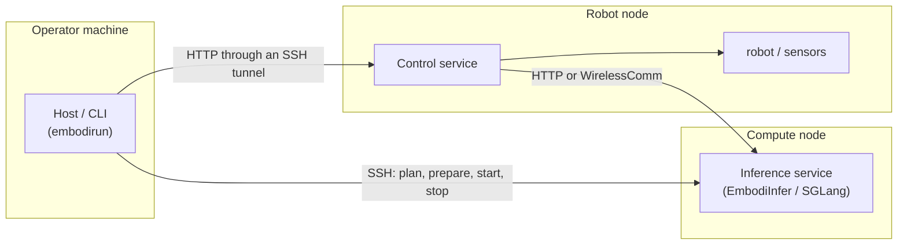
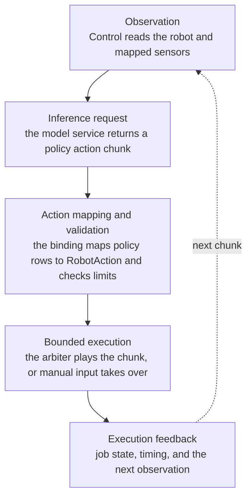

# Architecture

EmbodiRun is a deployment and execution runtime. It owns everything between a
policy's action output and a robot or simulator, and between an operator and a
running service. It does not own models or inference optimizations.

## Process boundaries

- **Host** runs only on the operator machine. It resolves configuration into a
  plan, prepares environments and sources over SSH, starts and stops
  identity-checked processes, and forwards tasks over a tunneled HTTP
  connection.
- **Control** runs beside the robot and owns the hardware. It owns observation
  sharing, execution arbitration, manual input, recording, and the loopback
  task API.
- **Inference** is a separate service. EmbodiInfer is the first-party engine;
  SGLang is supported through a provider. External services are never started
  or stopped by Host.

The nodes can be the same machine. The boundaries are process and environment
boundaries, not physical ones.

## Runtime domains

| Domain | Responsibility |
|---|---|
| `deployment` | Configuration, planning, state, environments, sources, SSH and process lifecycle. |
| `application` | Jobs, proposals, authentication, execution coordination, and the default model loop. |
| `devices` | Connection ownership, shared observations, action arbitration, teleoperation, recording. |
| `model_services` | Versioned inference contracts, HTTP/WirelessComm clients, provider registry. |
| `client` | Dependency-free public Agent client for the Control API. |
| `robots`, `bindings`, `simulators` | Hardware adapters, policy-to-robot mappings, simulator adapters. |
| `services` | CLI and HTTP entrypoints, plus compatibility imports for the former layout. |

New code targets the canonical domains. `services.*` paths remain importable
for existing deployments and resolve to the canonical modules.

## Deployment plan

`build_plan(config)` turns a YAML file into nodes, environment profiles,
services, and runtimes. It validates references, detects port conflicts, and
generates the adapter configuration each binding needs. The same plan drives
`init`, `up`, `down`, and `sync`, which is why `up` can detect a configuration
change since initialization.

## Inference contract

Control talks to inference over a versioned, model-neutral API
([`http_api.md`](http_api.md)). A session carries a stable `session_id`,
monotonic `step_id`, and unique `request_id`. Repeated request IDs are
idempotent while their responses remain cached. Requests include a task
instruction; checkpoint loading, model-specific prompt construction, and
tokenization belong to the inference service. The same schemas are carried by HTTP and WirelessComm; image bytes
are separate payload segments rather than base64.

## Execution path

An execution receipt describes execution state. It is not a statement that the
task succeeded; the application or agent decides that from evidence.

## Extending EmbodiRun

- **A new robot or simulator** implements the adapter interface and registers
  its type; a runtime then refers to it by `type`.
- **A new policy** adds a binding that maps observations and action chunks.
- **A new inference backend** registers a provider and ships a client; the
  deployment and execution path is unchanged.
- **A new agent** uses the public `client` and keeps its own planning loop.

## Non-goals

Model execution, prompt construction, model-output parsing, and task-level
planning or memory belong to EmbodiInfer, the model, or the agent. EmbodiRun
does not host checkpoints and does not import model frameworks.
