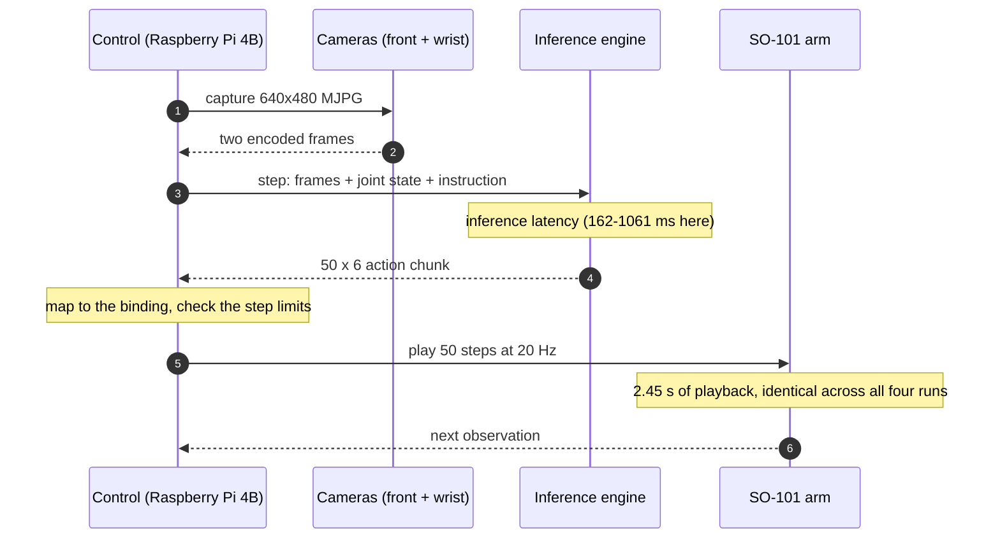

# Engine end-to-end contrast

One arm, one task, one checkpoint, one Wi-Fi link. Four engine and transport
combinations run the same task on real hardware, with per-chunk inference and
communication latency annotated in the video.

<video controls muted playsinline preload="metadata" width="720">
  <source src="https://raw.githubusercontent.com/BUAA-CI-LAB/misc/main/embodirun/v0.1/engine_e2e_contrast.mp4" type="video/mp4">
  Your browser does not support the video tag.
</video>

*29 s. Four columns: EmbodiInfer over WirelessComm, EmbodiInfer over HTTP,
SGLang, and the native LeRobot reference. Every column runs 15 chunks and is cut
after its own 8th, so the faster engines freeze first.*

Both the engine and its transport vary here, so the four columns are not a
single-variable experiment. Columns 1 and 2 isolate the transport — same engine,
same weights, different data plane. Columns 2 to 4 isolate the engine.

## What one chunk is

A chunk is a full control loop: observe the arm, ask the policy for an action
block, validate it, then play it back. Playback is fixed and identical in all
four runs; only the inference and communication in front of it differ.

## Setup

| | |
|---|---|
| Task | `Pick up the cube and place it in the bowl.` |
| Arm | SO-101 follower, 5 joints + gripper |
| Cameras | front and wrist, 640×480 MJPG, 20 Hz |
| Control host | Raspberry Pi 4 Model B (8 GB); runs the control loop and the recording |
| Inference host | Jetson AGX Thor Developer Kit, aarch64, CUDA 13 |
| Link | Wi-Fi. Both machines are on the same access point and neither wired port is used, so this compares the application-layer protocol and the engine — not wired against wireless. |
| Model | π0.5, SO-101 four-arm checkpoint, 10 denoising steps, quantile state/action normalization |
| Run length | 15 chunks per engine, once each; the cube is reset by hand before every run |

The control loop is nominally 20 Hz, so 50 steps should take 2.5 s. The measured
playback was 2453–2455 ms, i.e. about 20.4 Hz.

## Measurements

Median over the 15 chunks of each run:

| Engine | Transport | Inference | Comm + queue | Playback (fixed) | Chunk period | Inference speed-up |
|---|---|---:|---:|---:|---:|---:|
| **EmbodiInfer** | WirelessComm | **162 ms** | 42 ms | 2455 ms | **2660 ms** | **6.5×** |
| EmbodiInfer | HTTP | 170 ms | 45 ms | 2453 ms | 2666 ms | 6.2× |
| SGLang | HTTP | 194 ms | 65 ms | 2453 ms | 2713 ms | 5.5× |
| Native LeRobot | HTTP | 1061 ms | 82 ms | 2453 ms | 3592 ms | reference |

Each engine ran once, so these are single-run medians and not distributions.
The speed-up column is the inference ratio against the native LeRobot reference;
it is not the end-to-end ratio, which the fixed playback caps at −26%
(3592 ms → 2660 ms).

## Reading it honestly

This is a **tuned-versus-out-of-the-box** comparison, not an equal-effort one:

- EmbodiInfer runs its full set of optimisations: bfloat16, `inductor`
  compilation, prefix and denoising CUDA graphs, and Triton attention.
- SGLang runs upstream defaults. The one remaining candidate,
  `--enable-torch-compile`, was measured and gave no benefit.
- Native LeRobot deliberately runs plain eager, with no CUDA graph and no
  `torch.compile`. It is the reference point, and its 1061 ms can be compressed
  further, which would shrink the ratios above.

Three observations matter more than the headline ratio:

- **The whole gap between the engine columns is inference.** Expressed against
  each engine's own chunk period, communication and queueing are 1.6%, 1.7%,
  2.4% and 2.3% of the chunk for the four rows in order. Only 3 ms separates the
  two EmbodiInfer transports.
- **Playback dominates the fast columns, not the slow one.** It is 92% of the
  2660 ms chunk but only 68% of the 3592 ms reference chunk. Inference is 6% of
  the fastest chunk and 30% of the slowest.
- **Playback is a fixed cost you cannot optimise away here.** It is identical
  across all four engines, so making the task itself faster means changing the
  chunk length or the control rate, not the engine. All four runs completed the
  task within the first 8 chunks, before the video cuts them.

## Reproducing it

The four engines were served side by side on one GPU host, and each run warmed
up on real camera frames first — otherwise the first chunk carries one-off
compilation and dominates the median.

See [Inference API v1](../http_api.md) for the wire contract the runs use and
[Configuration](../configuration.md) for how a deployment selects a model and a
transport. [Inference transport](../inference-transport.md) measures the
HTTP/WirelessComm pair in isolation, where the engine is held constant.
