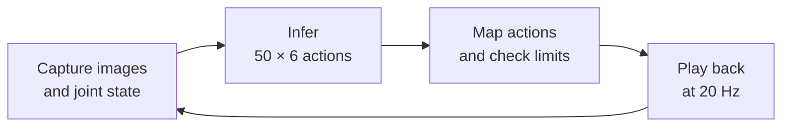

# Comparing inference engines on SO-101

How much does faster inference change a robot's control loop? This demo runs
the same π0.5 pick-and-place task with EmbodiInfer, SGLang, and native LeRobot
on a Jetson AGX Thor. With EmbodiInfer over WirelessComm, median inference
latency falls from **1,061 ms to 162 ms**, and a complete chunk takes
**2.66 seconds instead of 3.59 seconds**.

<video controls muted playsinline preload="metadata" width="720"
       poster="https://raw.githubusercontent.com/BUAA-CI-LAB/misc/main/embodirun/v0.1/engine_e2e_contrast.jpg">
  <source src="https://raw.githubusercontent.com/BUAA-CI-LAB/misc/main/embodirun/v0.1/engine_e2e_contrast.mp4" type="video/mp4">
  Your browser does not support the video tag.
</video>

*Left to right: EmbodiInfer over WirelessComm, EmbodiInfer over HTTP, SGLang,
and native LeRobot. The 29-second edit shows the first eight chunks of each
run; each panel freezes after its eighth chunk.*

## Task and hardware

A single SO-101 arm follows the instruction **“Pick up the cube and place it in
the bowl.”** All runs use the same arm, cameras, checkpoint, and Wi-Fi network.
The cube is reset by hand before each run.

| Component | Configuration |
|---|---|
| Robot | SO-101 follower: five arm joints and a gripper |
| Cameras | Front and wrist, 640 × 480 MJPG, configured at 20 fps |
| Control host | Raspberry Pi 4 Model B, 8 GB; runs control and recording |
| Inference host | Jetson AGX Thor Developer Kit, aarch64, CUDA 13 |
| Network | Both hosts connected to the same Wi-Fi access point |
| Policy | π0.5, SO-101 four-arm checkpoint, 10 denoising steps |
| Model input | Two images, six-dimensional joint/gripper state, and instruction |
| Model output | 50 × 6 action chunk; quantile state/action normalization |
| Execution | 50 action steps at a nominal 20 Hz |
| Measurement | One run of 15 chunks per configuration, after warmup on camera frames |

## Engine and transport settings

EmbodiInfer is measured with both transports. SGLang and native LeRobot use
HTTP, giving four configurations:

| Engine | Transport | Execution settings |
|---|---|---|
| EmbodiInfer | WirelessComm | BF16, Inductor, prefix and denoising CUDA graphs, Triton attention |
| EmbodiInfer | HTTP | Same model and engine settings as the WirelessComm run |
| SGLang | HTTP | Upstream defaults; enabling `--enable-torch-compile` gave no improvement in the setup check |
| Native LeRobot | HTTP | LeRobot `PI05Policy` and its processors, eager execution |

WirelessComm and HTTP both use the same physical Wi-Fi link. The transport
comparison is between application protocols, not between wireless and Ethernet.

## Inference latency and full-loop results

The table reports the median over all 15 chunks in each run.

| Engine | Transport | Inference | Communication + queueing | Action playback | Full chunk |
|---|---|---:|---:|---:|---:|
| **EmbodiInfer** | WirelessComm | **162 ms** | 42 ms | 2,455 ms | **2,660 ms** |
| EmbodiInfer | HTTP | 170 ms | 45 ms | 2,453 ms | 2,666 ms |
| SGLang | HTTP | 194 ms | 65 ms | 2,453 ms | 2,713 ms |
| Native LeRobot | HTTP | 1,061 ms | 82 ms | 2,453 ms | 3,592 ms |

Compared with native LeRobot, EmbodiInfer over WirelessComm delivers **6.5×
faster inference** and reduces the full chunk time by **932 ms, or 26%**.
The two EmbodiInfer transports have similar full-loop times: 2,660 and 2,666 ms.

The cube reaches the bowl within the first eight chunks of every run.

## Why playback dominates the faster runs

Each chunk captures an observation, runs inference, validates the returned
actions, and plays them back before starting the next chunk.

Fifty action samples contain 49 intervals at 20 Hz, or 2.45 seconds between
the first and last sample. This matches the measured playback time, which
stays almost unchanged across the four configurations.

Playback accounts for about **92%** of the fastest chunk, compared with
**68%** for native LeRobot. Faster inference removes most of the waiting before
motion; the arm still needs the same time to execute each action block.
Communication and queueing account for roughly 2% of the full chunk in these runs.

Video annotations

The labels `vvla-wireless` and `vvla` refer to EmbodiInfer under its former name.
The `inference` and `comm` overlays show the current chunk's values, while the
table above summarizes all 15 chunks. Each panel stops after its own eighth
chunk, so the faster configurations freeze earlier in the video.

## Compare your own deployment

Keep the checkpoint, camera mapping, action chunk length, and playback rate
fixed when changing engines. Warm up each configuration with camera frames
before timing, then record inference, communication, and action playback
separately.

[Configuration](../configuration.md) describes model and transport selection;
[Inference API v1](../http_api.md) defines the request/response contract.
For a focused HTTP/WirelessComm measurement, see the
[inference transport experiment](../inference-transport.md).
