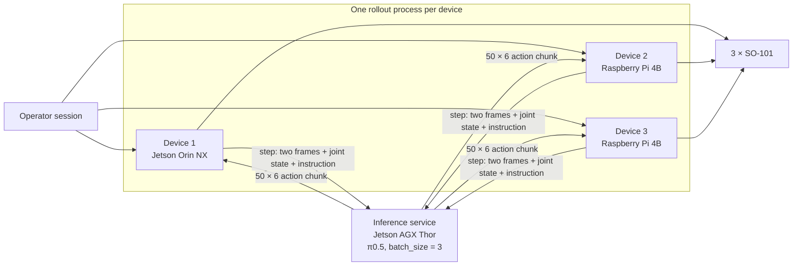

# Multi-robot serving

Three SO-101 arms driven from three separate rollout processes against one
π0.5 inference service, configured for `batch_size = 3`. Each device is a
different computer: one Jetson Orin NX and two Raspberry Pi 4B boards.

<video controls muted playsinline preload="metadata" width="720"
       poster="https://raw.githubusercontent.com/BUAA-CI-LAB/misc/main/embodirun/v0.1/multi_robot_serving.jpg">
  <source src="https://raw.githubusercontent.com/BUAA-CI-LAB/misc/main/embodirun/v0.1/multi_robot_serving.mp4" type="video/mp4">
  Your browser does not support the video tag.
</video>

*74 s. Six camera views: the three front cameras on the top row, the three wrist
cameras below, one column per device. The columns are three separate
recordings, aligned at their own start points rather than a shared clock.*

## What it shows

One operator session starts three rollout processes, and all three receive the
same instruction — **"Pick up the cube and place it in the bowl."** — from a
single inference service. There is no per-robot service and no per-robot
checkpoint. The service runs π0.5 on a Jetson AGX Thor over HTTP: 10 denoising
steps, bfloat16, CUDA graph enabled, and a 50-step action chunk played back by
each device at a nominal 20 Hz.

## The three runs

Recorded on 2026-09-18, with one run per device.

| | Device 1 | Device 2 | Device 3 |
|---|---|---|---|
| Compute | Jetson Orin NX, 8 cores / 16 GB | Raspberry Pi 4B, 4 cores / 8 GB | Raspberry Pi 4B, 4 cores / 8 GB |
| Arm and cameras | SO-101, front + wrist at 640×480 | same | same |
| Recording (ID, duration) | `demo-OrinNx-20260918-215928`, 191.9 s | `demo-Pi221-20260918-220827`, 97.8 s | `demo-Pi202-20260918-220708`, 49.0 s |
| Chunks executed | 53 | 26 | 13 |
| Cube in the bowl at | 14.5 s | 66.0 s | 9.0 s |
| Chunk period, median | 3588 ms | 3622 ms | 3620 ms |
| — playback, fixed | 2500 ms | 2500 ms | 2500 ms |
| — everything else | 1088 ms | 1122 ms | 1120 ms |
| Observation rate | 8.88 Hz | 8.46 Hz | 8.53 Hz |
| Effective action rate | 13.8 Hz | 13.4 Hz | 13.3 Hz |
| Dropped observations / actions / frames | 0 / 0 / 0 | 0 / 0 / 0 | 0 / 0 / 0 |

## What the numbers say

- **The three chunk periods agree to within 1%** (3588 / 3622 / 3620 ms) even
  though one device has twice the CPU cores and four times the memory of the
  other two.
- **The loop does not reach its nominal rate.** Playback is a fixed 2.5 s, but
  each chunk also carries about 1.1 s of inference, communication, and
  recording, so the arm runs at 13.3–13.8 Hz against a 20 Hz target. Playback
  is the largest single component at about 69% of the period; the remaining 31%
  covers inference, communication, and recording.
- **The recording path is stable.** Every device reports zero dropped
  observations, zero dropped actions, and zero missing frames across the run.
- **Sampling is slower than the cameras.** The cameras are configured for 20 fps
  but observations were produced at 8.5 Hz.

## Recording notes

- **Timing.** Each column starts at its own recording's beginning. The
  "cube in the bowl" times mark the placement event; recording continued
  until the operator stopped the run.
- **Device 3's gripper was miscalibrated.** Its travel span was 2248 ticks
  against 1518 on the other two, so the commanded closed position was not
  physically reachable. From 19.6 s the gripper stalled and the picture was
  static for 28 s; the video freezes that column at 21 s to skip the dead
  footage. Re-calibrate the gripper before the next run.
- **Task completion.** Placement was identified by reviewing the frames and
  the cube's colour track.

## Where the pieces live

The runtime, the robot binding, and the recording format are described in
[Architecture](../architecture.md) and [Configuration](../configuration.md).
[Engine end-to-end contrast](engine-e2e-contrast.md) draws the per-chunk loop
and compares inference engines on one of these devices. The inference service is
[EmbodiInfer](https://github.com/BUAA-CI-LAB/EmbodiInfer), reached over the
versioned [inference API](../http_api.md).
