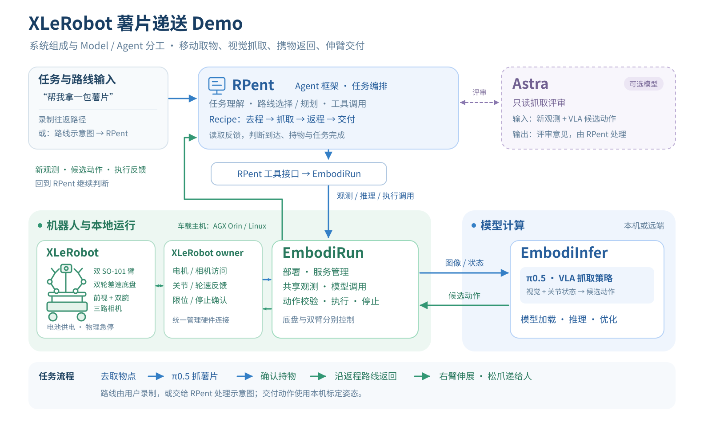

# XLeRobot snack-delivery demo

This demo shows an embodied agent driving an XLeRobot to a pickup point, using a
vision-language-action (VLA) policy to grasp a bag of chips, carrying it back,
and extending the right arm to hand it to a person. The page is a public
integration recipe: it describes the interfaces and the hardware that a new
operator must assemble, while leaving private routes and recordings with the
operator.

> **Demo video / GIF placeholder**
>
> Add the public video or GIF here when it is ready. The accompanying caption
> should state the route source, model, compute device, and playback speed.

The SVG is kept as editable text so that a deployment can replace labels,
measurements, or the final media link without redrawing the system diagram.

## Scenario

The scene has a delivery point, a table with the snack, and a traversable route
between them:

1. RPent receives a task such as “bring me a bag of chips” and selects the
   outbound route.
2. EmbodiRun brings the XLeRobot to the pickup point and obtains a fresh
   observation from the owner service.
3. EmbodiInfer serves a π0.5-style VLA policy. The policy receives the camera
   images, robot state, and grasp instruction, then returns a candidate action.
4. EmbodiRun validates a short action prefix, executes it through the XLeRobot
   owner, and waits for feedback that the object is held.
5. RPent selects the return route. After the robot reaches the delivery point,
   a calibrated right-arm pose extends the arm and releases the snack to the
   person.

The handover pose, gripper opening, route geometry, and action limits are
robot-specific. They must be calibrated on the operator's own machine.

## What “recipe” means here

A recipe is a public, reproducible description of one embodied scenario. It
binds together the task stages, the hardware roles, the model interface, the
route input, and the bring-up checks. It is not a copy of a private recording
and it does not contain a trajectory, access token, checkpoint, serial path, or
site-specific map.

This example supports two route inputs:

- **A route recorded by the operator.** Teleoperate the robot in the target
  space, save outbound and return route artifacts in the owner-supported format,
  and reference them from the deployment configuration.
- **A route sketch supplied to RPent.** Mark the delivery point, pickup point,
  and obstacles in a simple diagram. RPent can select or compose named local
  route segments. A sketch is planning input; it is not sent directly to the
  motors as a command.

Both inputs feed the same recipe stages. Route planning stays in RPent so that
this demo does not introduce a second planner inside EmbodiRun.

## System composition and responsibility split

| Component | Responsibility in this demo |
| --- | --- |
| **RPent** | Understand the task, select or plan routes, call tools, order pickup/return/handover stages, and interpret feedback. |
| **π0.5 / VLA** | Produce candidate grasp actions from current images, robot state, and the grasp instruction. |
| **Astra (optional)** | Read-only review of a fresh observation and a VLA candidate; it can recommend hold or approve, but it does not bypass the runtime. |
| **EmbodiRun** | Deploy services, share observations, call the model API, validate actions, execute bounded prefixes, stop, and report feedback. |
| **EmbodiInfer** | Load and serve the VLA checkpoint and perform inference or optimization. |
| **XLeRobot owner** | Own motor and camera access, expose joint/wheel feedback, enforce limits, and confirm stop state. |

The control boundary is the public EmbodiRun API. An agent calls `observe`,
`propose`, `execute`, `inspect`, `cancel`, and `stop`; it does not open a serial
port or camera directly. See [Agent execution workflow](../agent-workflow.md),
[Control](../control.md), and [Safety](../safety.md) for the request and
execution rules.

## Hardware bill of materials

The table is a planning list, not a purchase quote. Prices are approximate
values copied from the linked upstream pages and should be checked for region,
tax, shipping, and availability before buying.

| Item | Needed for the scene | Planning reference |
| --- | --- | --- |
| XLeRobot dual-wheel mobile base with two SO-101 follower arms | Yes | The upstream XLeRobot README lists a basic self-sourced build starting around **US$660**, excluding 3D printing, tools, shipping, and tax. See [XLeRobot](https://github.com/Vector-Wangel/XLeRobot) and its [two-wheel assembly guide](https://xlerobot.readthedocs.io/en/latest/hardware/getting_started/assemble_2wheel.html). |
| Front camera plus left/right wrist cameras | Yes | Use stable owner-defined camera roles and timestamps. The upstream project gives camera upgrade examples; the recipe does not require one brand. See [LeRobot documentation](https://huggingface.co/docs/lerobot/). |
| Battery, charger, motor wiring, mounting hardware, and a physical emergency stop | Yes | Size these for the assembled base and arms. Keep the emergency stop reachable throughout calibration and testing. |
| Linux compute host | Yes | An AGX Orin 64 GB class device is one possible local host. NVIDIA lists the AGX Orin 64 GB Developer Kit at **US$3,499** in its [Jetson FAQ](https://developer.nvidia.com/embedded/faq). Remote inference is also possible when the deployment network and API contract are configured. |
| Operator workstation and network path | Yes | Used for this repository, configuration, logs, and SSH or local access to the owner and Control services. |
| Teleoperation controller | Only for recorded-route mode | Use a controller supported by the owner integration, or the owner's keyboard path, to record a route on the target site. |

The total budget depends on what is already available. The XLeRobot platform
estimate does not include the compute host, cameras, battery, tools, or local
fabrication. The [XLeRobot README](https://github.com/Vector-Wangel/XLeRobot),
[SO-101 assembly guide](https://huggingface.co/docs/lerobot/main/assemble_so101),
and [NVIDIA Jetson FAQ](https://developer.nvidia.com/embedded/faq) are the
sources to re-check before publishing a purchase list.

## Software and configuration

A hardware run needs these separately owned pieces:

| Layer | What the operator prepares |
| --- | --- |
| Recipe host | Python 3.10+, this repository, and the public EmbodiRun client. |
| XLeRobot owner | The owner integration, one serial owner, stable device identities, motor IDs, arm calibration, camera roles, and feedback timestamps. Start in read-only mode. See [XLeRobot owner](../../integrations/xlerobot_owner/README.md). |
| EmbodiRun Control | A deployment YAML that names the Control runtime, device binding, action limits, observation freshness checks, and service endpoints. See [Configuration](../configuration.md) and [Control](../control.md). |
| VLA service | A π0.5/VLA service selected by the manipulation runtime ID. Checkpoints and model-server credentials stay in deployment-owned configuration; they are not committed here. See [π0.5 with two SO-101](../pi05-bi-so101.md) and [Inference API v1](../http_api.md). |
| RPent | The task and route planner that calls only the public EmbodiRun boundary. See [RPent integration](../rpent-integration.md). |
| Route artifacts | Either the operator's recorded outbound/return segments or route artifacts produced from a diagram by RPent. Keep private maps and recordings outside the public repository. |

The public README and this page intentionally do not ask a user to paste a
token. Authentication, private endpoints, checkpoints, and site-specific
paths belong in the deployment environment or an authenticated gateway.

## Bring-up and reproduction path

Use the repository's normal installation and safety workflow before attempting
this scene:

1. Assemble the base and both SO-101 arms using the upstream hardware guides.
   Label the buses and motors before applying power.
2. Configure motor IDs and calibrate each arm on the target robot. Read back
   units and limits instead of copying another robot's calibration.
3. Mount and bind the front and wrist cameras by stable device identity. Verify
   that the owner reports fresh images, state, and stop status.
4. Install the owner and Control services. Check serial ownership, feedback,
   camera roles, and the emergency stop in read-only mode before enabling
   motion.
5. Choose a route source and validate the route artifacts with a plan or dry
   run. Do not publish the recorded route as part of this example.
6. Calibrate the right-arm handover pose and gripper opening for the delivery
   surface and the person receiving the snack.
7. Start with a slow, supervised run. Inspect each bounded action and wait for
   fresh feedback before advancing to the next stage.

The [Quick start](../quickstart.md), [Agent execution workflow](../agent-workflow.md),
[Control](../control.md), and [Safety](../safety.md) pages describe the CLI and
runtime semantics. An accepted request is not proof that a robot completed the
physical action; retain the owner feedback and the final handover evidence.

> **Performance material placeholder**
>
> Add measured end-to-end latency, route duration, grasp success rate, handover
> success rate, hardware revision, model revision, and test count here when
> those results are public. Keep each number tied to its exact configuration.

> **Public run artifact placeholder**
>
> Add a sanitized deployment example, route sketch, or short run log here when
> it is ready. Do not add credentials, private maps, raw route traces, or
> personal data.

## References

- [EmbodiRun installation](../installation.md)
- [EmbodiRun architecture](../architecture.md)
- [EmbodiRun inference API](../http_api.md)
- [EmbodiRun RPent integration](../rpent-integration.md)
- [XLeRobot source and cost breakdown](https://github.com/Vector-Wangel/XLeRobot)
- [XLeRobot two-wheel assembly](https://xlerobot.readthedocs.io/en/latest/hardware/getting_started/assemble_2wheel.html)
- [LeRobot SO-101 assembly and calibration](https://huggingface.co/docs/lerobot/main/assemble_so101)
- [LeRobot documentation](https://huggingface.co/docs/lerobot/)
- [NVIDIA Jetson FAQ](https://developer.nvidia.com/embedded/faq)
