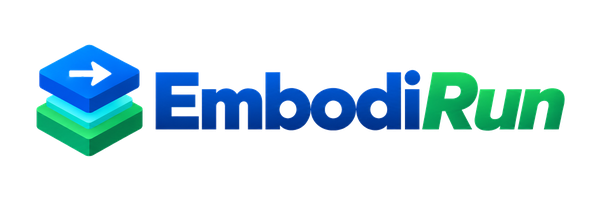

<div class="hero" markdown>

<h1 class="hero-title">
  
</h1>

**Embodied AI, Ready to Run.**

Configure a model, a compute node, and a robot or simulator — then run the whole
loop from one file.

[Quick start](quickstart.md){ .md-button .md-button--primary }
[Architecture](architecture.md){ .md-button }
[GitHub](https://github.com/BUAA-CI-LAB/EmbodiRun){ .md-button }

</div>

EmbodiRun connects model inference, service deployment, cross-node communication,
and robot execution into one reproducible system. High-performance inference is
provided by [EmbodiInfer](https://github.com/BUAA-CI-LAB/EmbodiInfer), which stays
an independent engine and can also be used on its own.

## Choose a path

<div class="grid cards" markdown>

-   :material-rocket-launch:{ .lg .middle } __Deploy__

    ---

    Install from source, run a device-free example, then write a deployment YAML.

    [:octicons-arrow-right-24: Quick start](quickstart.md)

    [:octicons-arrow-right-24: Configuration](configuration.md)

-   :material-robot:{ .lg .middle } __Operate a robot__

    ---

    Control authority, bounded execution, manual takeover, and the software stop.

    [:octicons-arrow-right-24: Control](control.md)

    [:octicons-arrow-right-24: Safety](safety.md)

-   :material-connection:{ .lg .middle } __Integrate a model or agent__

    ---

    Connect policies and agents through the versioned inference API.

    [:octicons-arrow-right-24: Inference API v1](http_api.md)

    [:octicons-arrow-right-24: RPent](rpent-integration.md)

-   :material-sitemap:{ .lg .middle } __Understand the runtime__

    ---

    Runtime domains, process boundaries, ownership, and non-goals.

    [:octicons-arrow-right-24: Architecture](architecture.md)

    [:octicons-arrow-right-24: Support matrix](support-matrix.md)

</div>

## How it fits together

```text
              model / agent
                    │
                    ▼
   ┌────────────────────────────────┐
   │           EmbodiRun            │
   │  configuration · coordination  │
   │  control authority · safety    │
   └───────┬────────────────┬───────┘
           │                │
           ▼                ▼
   ┌───────────────┐  ┌──────────────┐
   │  EmbodiInfer  │  │  transport   │
   │  HTTP /       │  │  HTTP or     │
   │  WirelessComm │  │  WirelessComm│
   └───────────────┘  └──────┬───────┘
                             │
                             ▼
                    robot or simulator
```

## Status

The [support matrix](support-matrix.md) distinguishes source adapters,
CPU-verified software, real-model runs, and real-robot cases; a combination is
never marked **Tested** from code presence alone. Claims on the
[experiment pages](experiments.md) are scoped to the configuration that was
measured, and an unverified path is labelled as such.

## Community

- [Contributing](contributing.md) — development setup, pull request
  expectations, and the support-matrix rule.
- [Code of Conduct](code-of-conduct.md) — the Contributor Covenant 2.1 adopted
  by this project.
- [Security policy](https://github.com/BUAA-CI-LAB/EmbodiRun/blob/main/SECURITY.md)
  — report vulnerabilities privately, never in a public issue.
- [License and relicensing](license.md) — Apache-2.0 and the move from MIT.

The repository README is available in
[English](https://github.com/BUAA-CI-LAB/EmbodiRun/blob/main/README.md) and
[简体中文](https://github.com/BUAA-CI-LAB/EmbodiRun/blob/main/README.zh-CN.md).
