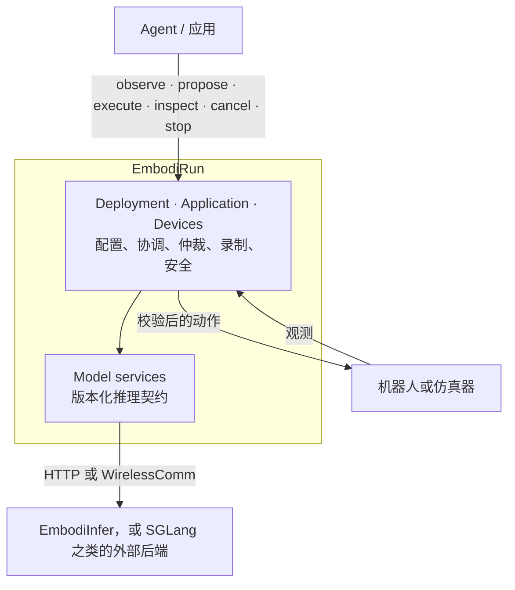

<h1 class="hero-title">
  
</h1>

**具身智能，开箱即跑。**

配置一个模型、一个算力节点、一台机器人或仿真器 —— 然后用一个文件跑通整条链路。

[快速开始](quickstart.md){ .md-button .md-button--primary }
[GitHub](https://github.com/BUAA-CI-LAB/EmbodiRun){ .md-button }

!!! note "翻译进度"
    中文文档目前只覆盖本页和[快速开始](quickstart.md)。其余页面尚未翻译，请阅读
    [英文文档](https://embodirun.readthedocs.io/en/latest/)。中英两版是各自独立构建的，
    英文版始终是最新的；如果你发现中文内容落后于代码，请以英文版为准。

EmbodiRun 把模型推理、服务部署、跨节点通信和机器人执行连成一个可复现的系统。
高性能推理由 [EmbodiInfer](https://github.com/BUAA-CI-LAB/EmbodiInfer) 提供，
它保持为一个独立引擎，也可以单独使用。

## 选择你的路径

-   :material-rocket-launch:{ .lg .middle } __部署__

    ---

    从源码安装，跑一个不需要硬件的例子，然后写一份部署 YAML。

    [:octicons-arrow-right-24: 快速开始](quickstart.md)

    [:octicons-arrow-right-24: 配置（英文）](https://embodirun.readthedocs.io/en/latest/configuration/)

-   :material-robot:{ .lg .middle } __操作机器人__

    ---

    控制权归属、有界执行、人工接管，以及软件急停。

    [:octicons-arrow-right-24: Control（英文）](https://embodirun.readthedocs.io/en/latest/control/)

    [:octicons-arrow-right-24: Safety（英文）](https://embodirun.readthedocs.io/en/latest/safety/)

-   :material-connection:{ .lg .middle } __接入模型或 Agent__

    ---

    通过版本化的推理 API 接入策略与 Agent。

    [:octicons-arrow-right-24: Inference API v1（英文）](https://embodirun.readthedocs.io/en/latest/http_api/)

    [:octicons-arrow-right-24: RPent（英文）](https://embodirun.readthedocs.io/en/latest/rpent-integration/)

-   :material-sitemap:{ .lg .middle } __理解运行时__

    ---

    运行时的域划分、进程边界、所有权，以及明确的非目标。

    [:octicons-arrow-right-24: Architecture（英文）](https://embodirun.readthedocs.io/en/latest/architecture/)

    [:octicons-arrow-right-24: Support matrix（英文）](https://embodirun.readthedocs.io/en/latest/support-matrix/)

## 各部分如何拼在一起

## 状态

[支持矩阵](https://embodirun.readthedocs.io/en/latest/support-matrix/)把源码适配器、
CPU 软件验证、真实模型运行和真机案例区分开；**任何组合都不会仅凭代码存在就被标为 Tested**。
[实验页面](https://embodirun.readthedocs.io/en/latest/experiments/)上的结论只在该页记录的
配置下成立，未经验证的路径会被明确标注。

## 社区

- [参与贡献](https://github.com/BUAA-CI-LAB/EmbodiRun/blob/main/CONTRIBUTING.md) —— 开发环境、
  Pull Request 的期望，以及支持矩阵的规则。
- [行为准则](https://github.com/BUAA-CI-LAB/EmbodiRun/blob/main/CODE_OF_CONDUCT.md) ——
  本项目采用的 Contributor Covenant 2.1。
- [安全政策](https://github.com/BUAA-CI-LAB/EmbodiRun/blob/main/SECURITY.md) ——
  漏洞请私下报告，绝不要开在公开 issue 里。
- [许可证与重新许可](https://github.com/BUAA-CI-LAB/EmbodiRun/blob/main/docs/license.md) ——
  Apache-2.0，以及从 MIT 迁移的原因。

仓库 README 提供[英文版](https://github.com/BUAA-CI-LAB/EmbodiRun/blob/main/README.md)和
[简体中文版](https://github.com/BUAA-CI-LAB/EmbodiRun/blob/main/README.zh-CN.md)。
