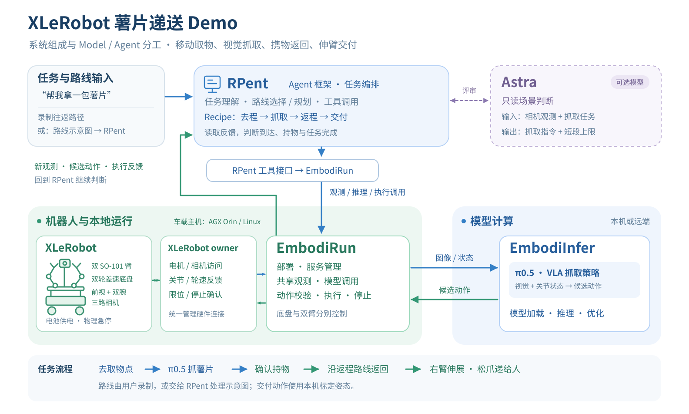

# 场景编排与 RPent 接口

[Demo 介绍](README.md) · [完整运行指南](guide.md)

recipe 组织去程、抓取、返程与交付。RPent 负责视觉场景决策和路线选择；EmbodiRun 负责共享观测、VLA 服务请求、动作校验、执行和停止；唯一 XLeRobot owner 访问串口和相机。

底盘 Control 和机械臂 Control 分别绑定 `base`、`arms` scope。它们使用同一个外部 owner；`runtime_id` 是执行目标身份校验，不会把一个 Control 实例动态切换成另一个硬件 scope。

## RPent 工厂

`agent.factory` 是 `module:callable`，接收 `agent.options`，返回提供下列方法的对象。默认实现位于 [snack_agent.py](../../../../agents/rpent/snack_agent.py)，复用已有 Astra 隔离进程方式和登录状态；完整 RPent 可提供自己的工厂。

| 方法 | 输入 | 输出 |
| --- | --- | --- |
| `before_grasp(packet)` | observation_id、观测、对应图片的 MIME/base64、任务指令、max_steps | 同一个 observation_id、decision=`proceed`/`hold`、instruction、max_steps、reason |
| `plan_routes(packet)` | 示意图和已录制方向片段的名字/注释 | decision、outbound/return 片段名字列表、reason |

RPent 不获得 Control client 或电机工具。Agent 返回的步数不能超过 recipe 的配置上限；返回名字不能超出已声明片段库。图像内容作为场景数据处理。

## 抓取时序

1. 人工确认桌面和通路；读取新观测及同一快照中的相机图像。
2. RPent/Astra 判断场景并选择抓取指令或 hold。
3. 等待 Agent 决策之后采集的新状态，再用该 observation_id 调用 `/v1/propose`。
4. `lerobot.xlerobot.pi05` 将带名字的原生单位输出映射为 XLeRobot 动作，recipe 校验 action_space、逐字段 units 和 arms scope。
5. 复查提议所依据的快照仍 fresh，执行短前缀；保留剩余动作作为记录，不自动执行。
6. 等待新反馈、停止确认和持物证据，再决定继续抓取或进入返程。

原有 `PublicCooperativeSession` 的 BiSO101 50×12 提议后评审仍是独立接口。本 recipe 使用具名 XLeRobot 字段和提议前场景决策，不把两种动作格式隐式互换。

## 时间和证据

owner 使用单调时钟报告状态/图像已经存在的时长，代理以请求发起时间减去该时长，得到包含网络耗时的保守本地采集时间。原始远端时间仍保留；没有时长的旧 owner 不会被接收时间伪装成 fresh。

停止请求的回执与停止完成分开记录。底盘零速不清除历史停止故障，人工持物/到站确认也不替代传感器停止确认。`task_success` 和 `physical_success` 只来自各自配置的最终证据。
